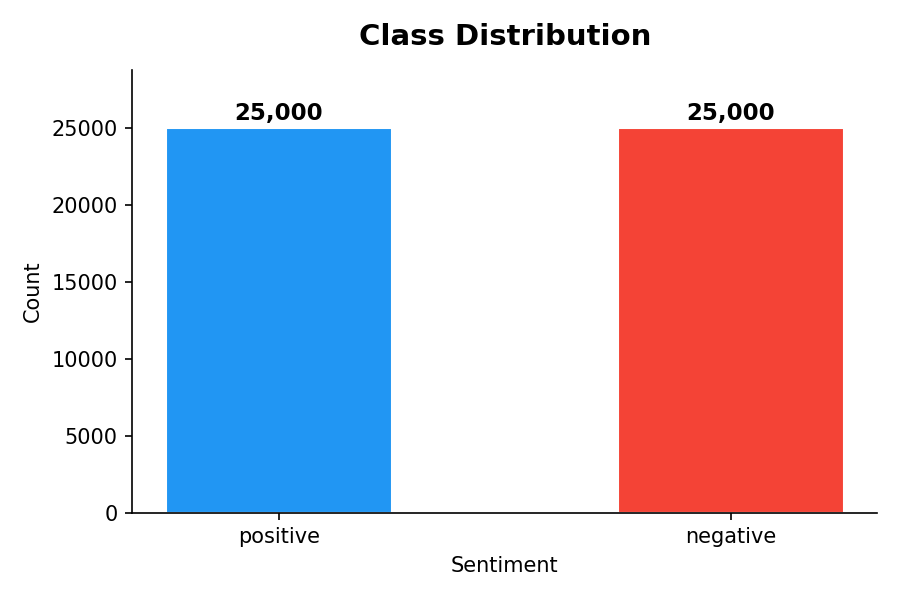
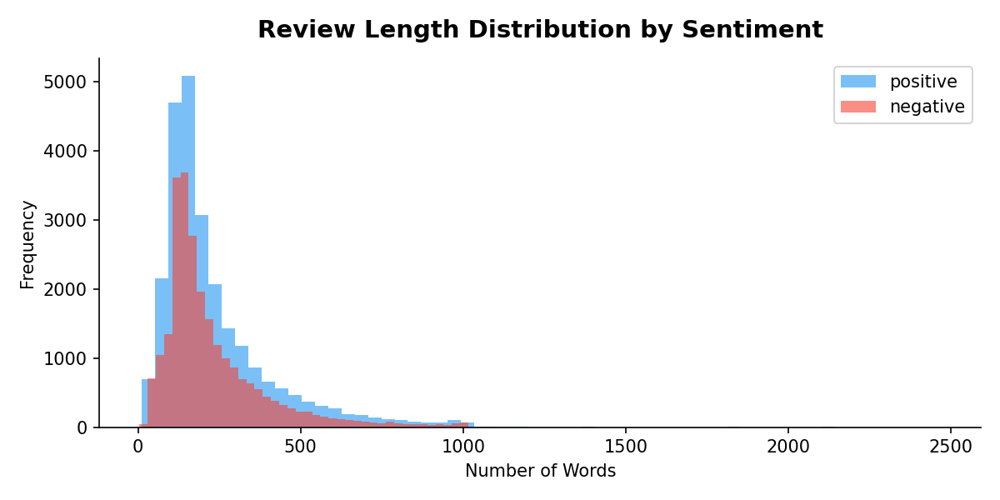
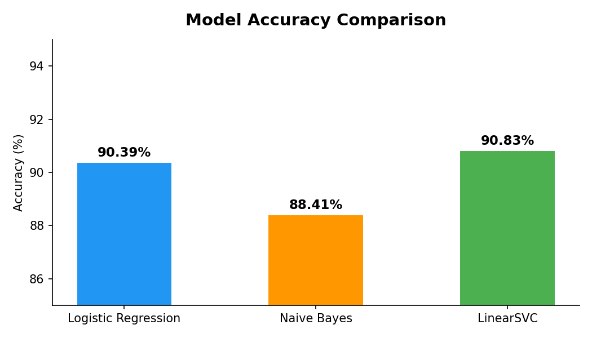
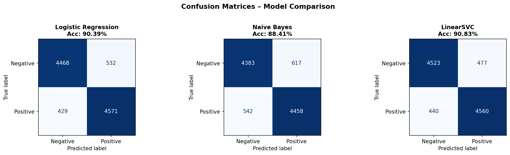

# 🎬 IMDB Sentiment Classifier

A machine learning project that classifies movie reviews as **positive** or **negative** using NLP techniques and classical ML models trained on 50,000 IMDB reviews.

---

## 📊 Results

| Model | Accuracy | Precision | Recall | F1-Score |
|---|---|---|---|---|
| **LinearSVC** ⭐ | **90.83%** | 0.91 | 0.91 | 0.91 |
| Logistic Regression | 90.39% | 0.90 | 0.90 | 0.90 |
| Naive Bayes | 88.41% | 0.88 | 0.88 | 0.88 |

> **Best Model:** LinearSVC with TF-IDF (unigrams + bigrams) — 90.83% accuracy on 10,000 held-out reviews.

---

## 📁 Project Structure

```
sentiment-classifier/
├── data/                        # Place IMDB_Dataset.csv here (not tracked)
├── notebooks/
│   └── eda.ipynb                # Exploratory Data Analysis
├── src/
│   ├── train.py                 # Train & evaluate all models
│   └── predict.py               # Run predictions on new text
├── results/
│   ├── confusion_matrices.png
│   ├── model_comparison.png
│   ├── class_distribution.png
│   └── review_length_distribution.png
├── model/                       # Saved model & vectorizer (generated after training)
├── requirements.txt
└── .gitignore
```

---

## 🛠️ Tech Stack

- **Language:** Python 3.10+
- **NLP / ML:** Scikit-learn, TF-IDF Vectorizer, NLTK (stopwords)
- **Models:** Logistic Regression, Multinomial Naive Bayes, LinearSVC
- **EDA & Visualization:** Pandas, NumPy, Matplotlib, Seaborn

---

## 🚀 Getting Started

### 1. Clone the repository
```bash
git clone https://github.com/HirdeshPal888527/sentiment-classifier.git
cd sentiment-classifier
```

### 2. Install dependencies
```bash
pip install -r requirements.txt
```

### 3. Download the dataset
Download the IMDB Dataset from [Kaggle](https://www.kaggle.com/datasets/lakshmi25npathi/imdb-dataset-of-50k-movie-reviews) and place it at:
```
data/IMDB_Dataset.csv
```

### 4. Train the models
```bash
python src/train.py
```
This will:
- Clean and preprocess all 50,000 reviews
- Train and evaluate 3 ML models
- Save plots to `results/`
- Save the best model to `model/`

### 5. Predict on new text
```bash
# Single review
python src/predict.py "The acting was phenomenal and the story kept me hooked!"

# Interactive mode
python src/predict.py
```

---

## 🔍 Approach

### Text Preprocessing Pipeline
1. **HTML stripping** — 72%+ of reviews contain `<br />` tags
2. **Regex cleaning** — remove punctuation and non-alphabetic characters
3. **Lowercasing**
4. **Stopword removal** — custom stopword list (no external download needed)
5. **Short token filtering** — remove tokens with length ≤ 2

### Feature Extraction
- **TF-IDF Vectorizer** with `max_features=50,000` and `ngram_range=(1,2)`
- Unigrams + bigrams capture phrase-level patterns (e.g. "not good", "very bad")
- `sublinear_tf=True` dampens the effect of very frequent terms

### Models Compared
- **Logistic Regression** — strong linear baseline, fast and interpretable
- **Naive Bayes** — simple probabilistic model, fastest to train
- **LinearSVC** — best performer; margin-based classifier suited for high-dimensional text

---

## 📈 Visualizations

### Class Distribution


### Review Length by Sentiment


### Model Comparison


### Confusion Matrices


---

## 🧠 Key Learnings

- Balanced datasets (50/50 split here) remove the need for oversampling techniques like SMOTE
- Bigrams significantly improve accuracy over unigrams alone by capturing negation patterns
- LinearSVC outperforms Logistic Regression on high-dimensional sparse text features
- HTML stripping is critical — skipping it noticeably hurts vectorizer quality

---

## 👤 Author

**Hirdesh Pal**
B.Tech – Energy Engineering, IIT Guwahati
[GitHub](https://github.com/HirdeshPal888527) | [LinkedIn](https://linkedin.com/in/Hirdesh-Pal) | hirdesh@iitg.ac.in

---


